<div align="center">

<!-- Animated Banner -->


</div>

<div align="center">

<!-- Typing SVG Row 1 -->


</div>

---

## ⚡ About Me

```python
class Ezequiel:
    def __init__(self):
        self.role     = "Full-Stack Developer"
        self.location = "Building cool things 🌍"
        self.focus    = ["AI", "Computer Vision", "Web Apps"]
        self.learning = ["Advanced Python", "AI Chatbots", "Full-Stack Dev"]
        self.os       = "Manjaro Linux 🐧"
        self.hobbies  = ["Gaming 🎮", "Music 🎵", "Ricing my Linux"]
        self.motto    = "Code. Learn. Repeat."

    def __repr__(self):
        return (
            f"<{self.__class__.__name__} | "
            f"{self.role} | "
            f'"{self.motto}">'
        )

me = Ezequiel()
print(me)
# <Ezequiel | Full-Stack Developer | "Code. Learn. Repeat.">
```

---

## 🛠️ Tech Stack

<div align="center">

<!-- Languages -->
**Languages**


<!-- Frontend -->
**Frontend**


<!-- Backend & AI -->
**Backend & AI**


<!-- Tools -->
**Tools & Environment**


---

## 📊 GitHub Statistics

<div align="center">
  
    
  
</div>

<div align="center">
  

  
</div>

---

## 🏆 Trophies

<div align="center">
  
</div>

---

## 🔭 Currently Working On

<div align="center">

|          🐧 Linux Knowldge          |                    👁️ Computer Vision                    |                      🌐 Web Apps                      |
| :--------------------------------: | :-----------------------------------------------------: | :--------------------------------------------------: |
| Building customizeed Linux Desktop | Real-time object detection & image processing pipelines | Full-stack apps with modern React & FastAPI backends |

</div>

---

## 📈 Contribution Snake

<div align="center">
  
</div>

---

## 💬 Dev Quote

<div align="center">
  
</div>

---

## 🌐 Connect With Me

<div align="center">

[](https://github.com/Noro18)
[](https://linkedin.com)


</div>

---

<div align="center">

**Profile Views**


<!-- Footer Wave -->


</div>
